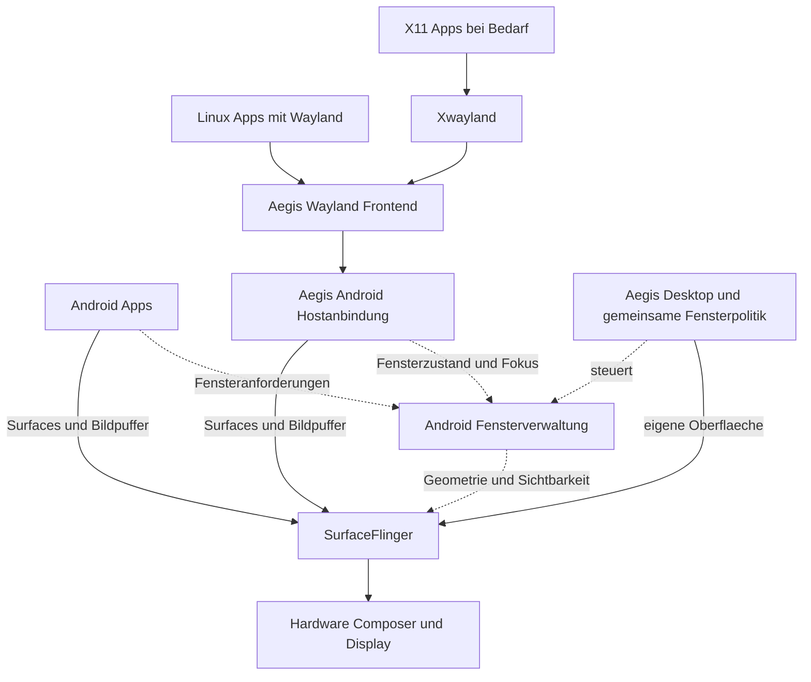

# Gemeinsame Grafik für Android und Linux

Stand: 1. Oktober 2026. Die Architekturrichtung ist mit dem Nutzer abgestimmt:
Das Aegis-Wayland-Frontend soll für Linux-Anwendungen die Rolle von Mutter
beziehungsweise KWin übernehmen und Androids Grafikunterbau gemeinsam nutzen.
Dieses Dokument ergänzt den [Desktop-Plan](desktop-and-cli.md).
Implementierung und Machbarkeit sind noch nicht abgenommen; es wurden keine
Grafikdienste installiert, umgestellt oder im Gast getestet.

Die [vertiefte Recherche](#vertiefte-recherche-zu-gemeinsamen-bausteinen)
empfiehlt, diese Richtung mit vorhandenen Wayland-Bibliotheken, Android-
Hostfenstern und Linux-Dienstschnittstellen umzusetzen. Diese Empfehlungen
sind noch keine beschlossene Bibliotheksauswahl oder Implementierung.

## Architekturrichtung

Das Nutzerziel lautet: so wenig parallele Infrastruktur wie möglich, so viel
wie für Kompatibilität und sichere Trennung nötig. Geplant ist
**SurfaceFlinger als gemeinsame abschließende Kompositionsinstanz**, ergänzt
um die eigene Aegis-Bedienung und ein Wayland-Protokollfrontend für Linux-Apps.

Ein solcher Adapter wäre aus Sicht der Linux-Programme weiterhin ein
Wayland-Server. Er müsste aber keinen zweiten Desktop erzeugen und keine eigene
Bildschirmausgabe besitzen. Das Ziel ist eine gemeinsame Fenster- und
Eingabepolitik sowie ein gemeinsamer Ausgabepfad. Eine exakt vorgegebene Zahl
von Prozessen wäre dafür kein sinnvolles Abnahmekriterium.

## Ersatz der Compositorrolle für Linux Anwendungen

Das Kompatibilitätsziel ist, vorhandene Linux-Anwendungen möglichst ohne
anwendungsspezifische Portierung im Aegis-Desktop zu verwenden. Das Frontend
übernimmt deren Wayland-Fensteranforderungen, Pufferübergabe und Eingabeereignisse.
Fensterzustand, Fokus und Sichtbarkeit werden mit der gemeinsamen
Aegis-/Android-Fenstersteuerung abgestimmt; die abschließende Komposition
bleibt bei SurfaceFlinger.

GNOME-Shell-Erweiterungen und KWin-Plugins einschließlich KWin-Skripten und
Effekten sind ausdrücklich außerhalb des Projektumfangs. Auch ein binär
austauschbarer `libmutter`-Ersatz und die Ausführung unveränderter GNOME-Shell-/
Plasma-Desktopkomponenten sind kein Ziel. Aegis erhält seine eigene Oberfläche.
Die Kompatibilität richtet sich auf Anwendungen und die dafür benötigten
Schnittstellen; GTK- und Qt-Anwendungen aus dem GNOME-/KDE-Umfeld gehören
weiterhin zu diesem Ziel.
[Mutter](https://mutter.gnome.org/), [KWin](https://github.com/KDE/kwin).

Breite Kompatibilität wird anhand folgender Bereiche geplant und nachgewiesen:

| Bereich | Aufgabe des Frontends beziehungsweise der ergänzenden Integration |
| --- | --- |
| Wayland-Fenster | Kernprotokoll, xdg-shell, Unterflächen, Popups und korrekte Zustandswechsel umsetzen. Weitere Protokolle anhand der benötigten Apps priorisieren. |
| Darstellung | Softwarepuffer sowie benötigte EGL-/Vulkan-Pfade, Formate, Synchronisation, Skalierung und Bildtakt prüfen. |
| Bedienung | Gemeinsamer Fokus, Tastatur, Maus, Touch und Texteingabe; Zwischenablage und Drag-and-drop in die persönliche Sitzung einordnen. |
| X11-Anwendungen | Rootless Xwayland bei Bedarf samt Fensterverwaltungsanbindung betreiben. |
| Desktop-Dienste | Benötigte Portals, Benachrichtigungen, Dateiauswahl und Barrierefreiheit gesondert integrieren; das Wayland-Protokoll allein deckt sie nicht ab. |

Standardschnittstellen haben Vorrang. Zusätzliche Protokollerweiterungen für
Anwendungen werden anhand konkreten Bedarfs bewertet, auch wenn sie aus dem
GNOME-/KDE-Umfeld stammen. Daraus folgt keine Unterstützung der
Erweiterungs- und Plugin-Systeme dieser Desktops. Nur tatsächlich implementierte
und funktionsfähige Protokollversionen dürfen angeboten werden.
Benutzerzuordnung und Berechtigungen bleiben durch Aegis/AOSP vorgegeben;
Kompatibilität darf nicht durch ungeprüften Zugriff auf fremde Sitzungen entstehen.

Für GTK-, Qt-, SDL-, Chromium-/Electron- und ausgewählte X11-Anwendungen wird
eine Testmatrix mit konkreter Paketversion, erforderlichen Protokollen und
Diensten, Grafikpfad sowie Ergebnis und Einschränkungen aufgebaut. Ein sichtbares
Fenster allein gilt nicht als Kompatibilitätsnachweis. Diese Matrix und die
Prototypen müssen erst erstellt werden; eine allgemeine Kompatibilitätsquote
oder Gleichwertigkeit mit Mutter/KWin wird noch nicht behauptet.

## Belegte Grundlagen

Android trennt Fenstersteuerung und Komposition: WindowManager verwaltet
unter anderem Lebenszyklus, Fokus und Geometrie; SurfaceFlinger verarbeitet
die Bildflächen und stimmt die Ausgabe mit dem Hardware Composer ab.
SurfaceControl erlaubt die Übergabe einzelner Flächen. Eine sichtbare Fläche
allein ist jedoch noch kein vollständig integriertes Anwendungsfenster.
[AOSP-Grafikarchitektur](https://source.android.com/docs/core/graphics/surfaceflinger-windowmanager).

Wayland ist ein Protokoll mit zugehörigen Bibliotheken, kein zwingend separat
zu installierender Desktop. Die konkrete Serverimplementierung bestimmt die
Integration. Ein bestehendes Beispiel für eine Einbettung in eine andere Shell
ist Chromiums Exo auf Aura; es ist kein fertiger SurfaceFlinger-Adapter.
[Wayland](https://wayland.freedesktop.org/),
[Exo](https://chromium.googlesource.com/chromium/src/+/main/components/exo/README.md).

GTK und Qt besitzen Wayland-Zugänge. Android-Backends einzelner Toolkits
ersetzen die Laufzeitkompatibilität vorhandener Debian-Pakete nicht: Ein für
Android neu gebautes Programm ist ein anderer Integrationsweg. Deshalb sollte
die Hauptstrategie ein gemeinsamer Protokollzugang sein, statt je Toolkit
einen eigenen Aegis-Port dauerhaft zu pflegen.
[GTK](https://docs.gtk.org/gtk4/wayland.html),
[Qt-Plattformintegration](https://doc.qt.io/qt-6/qpa.html).

## Vergleich der Wege

| Weg | Zusätzliche Infrastruktur | Bewertung für AegisOS |
| --- | --- | --- |
| SurfaceFlinger mit Wayland-Frontend | Protokollserver und Integration in Android-Fenster und Eingaben | Gewählte Architekturrichtung; technische Machbarkeit und Integrationsarbeit bleiben nachzuweisen. |
| Linux-Compositor innerhalb eines Android-Fensters | Zusätzliche Linux-Komposition vor der Android-Ausgabe | Als Vergleichsaufbau denkbar; erfüllt das gewünschte Ziel noch nicht. |
| Wayland als Hauptausgabe mit Android-Brücke | Host-Compositor und weiter bestehende Android-Grafikdienste | Waydroid-artige Richtung; beseitigt die doppelte Struktur nicht automatisch. |
| SurfaceFlinger vollständig ersetzen | Eigene Implementierung der erforderlichen Android-Verträge | Größter Kompatibilitäts- und Wartungseingriff; derzeit kein erster Schritt. |

Der Waydroid-Hardware-Composer verbindet Android mit einem Wayland-Server;
er belegt eine Brücke unter dem Android-Grafiksystem, keinen einfachen Ersatz
aller Android-Fensterdienste. Sein untersuchter `lineage-20`-Zweig ist außerdem
kein Übernahmenachweis für unsere AOSP-16-Basis.
[Waydroid-Quellcode](https://github.com/waydroid/android_hardware_waydroid/blob/lineage-20/hwcomposer/wayland-hwc.cpp).

## Vorgeschlagener Aufbau

Durchgezogene Pfeile zeigen den geplanten Darstellungsweg, gestrichelte die
Fenstersteuerung. WindowManager ist kein zwingender Durchlauf für Pixel.
Die Schnittstellen sind noch nicht implementiert.
Android soll die physischen Eingabegeräte weiter verwalten.
Das Frontend erhält nur die seiner Sitzung und seinen Fenstern zugewiesenen
Ereignisse und übersetzt sie für Linux-Programme. App-Start, Fensteridentität
und Fokus müssen in das gemeinsame Sitzungsmodell eingebunden werden.
[AOSP-Eingabearchitektur](https://source.android.com/docs/core/interaction/input).

Xwayland wird nur für benötigte X11-Anwendungen eingeplant. Es ist ein echter
zusätzlicher X-Server, besitzt aber selbst keine physische Bildausgabe.
Für einzelne integrierte Fenster braucht der Adapter zusätzlich eine
X-Window-Manager-Anbindung. Ein gemeinsamer X-Server isoliert seine eigenen
X11-Clients nicht voneinander; verschiedene persönliche Benutzer dürfen ihn
deshalb nicht ungetrennt gemeinsam nutzen.
[Xwayland-Architektur](https://wayland.freedesktop.org/docs/book/Xwayland.html).

## Konkreter Evaluationskandidat

Anland ist ein Studienobjekt, keine beschlossene Abhängigkeit. Die erste
Untersuchung beschränkte sich auf seine Projektbeschreibung. Die vertiefte
Recherche hat ausgewählte Dateien des Commits
`cc1691805fe6aca6851b6fcccb6a1e33019026c1` gelesen: Host-Activities,
SurfaceControl-Anbindung und Pufferimport. Das ersetzt weder einen Build noch
einen Laufzeittest oder ein vollständiges Code-/Sicherheitsaudit.
Die [Befunde unten](#fensterintegration-mit-android-hostfenstern) zeigen sowohl
brauchbare Integrationsmuster als auch erhebliche gerätespezifische Grenzen.
Benutzer-, Binder- und Root-Annahmen müssen gegen unsere AOSP-Identität und
Runtime-Isolation geprüft werden.
[Anland am untersuchten Commit](https://github.com/SuperTurtleDev/anland/tree/cc1691805fe6aca6851b6fcccb6a1e33019026c1).

## Die entscheidenden offenen Nachweise

**Grafikpuffer und Leistung.** Linux-Grafikpuffer lassen sich nicht allein durch
einen Dateideskriptor als Android-Puffer behandeln. Androids SurfaceControl
verwendet AHardwareBuffer und Synchronisations-Fences. Formate, Speicherlayout,
Allocator, Treiber und Freigabezeitpunkte müssen zusammenpassen. Ein Softwarepfad
mit Kopieren ist als erster Versuch brauchbar; GPU-Kompatibilität und Zero-copy
bleiben gesondert nachzuweisen.
[NDK-Pufferübergabe](https://developer.android.com/ndk/reference/group/native-activity),
[BufferQueue und Gralloc](https://source.android.com/docs/core/graphics/arch-bq-gralloc).

**Fensterverhalten.** Der Adapter braucht mehr als Bildtransport: Hauptfenster,
Popups, Unterflächen, Resize-Bestätigungen, Bildtakt, Skalierung, Cursor und
Tastatureingabe. Danach folgen Bildschirmtastatur, Zwischenablage,
Drag-and-drop und Barrierefreiheit. Die benötigten Protokolle müssen anhand
einer konkreten App-Auswahl festgelegt werden.

**Isolation.** Die gelesene [Runtime-Gerätevorbereitung](../../packages/aegis/identity/runtime/devices.c)
stellt bewusst weder Binder noch Grafik- oder Eingabegeräte bereit. Eine GUI
braucht daher eine neue, begrenzte und widerrufbare Verbindung. Die interne
UID 1000 oder ein vom Client behaupteter App-Name ist kein Identitätsnachweis.
Sperre, Benutzerwechsel und Logout müssen auch Fenster, Eingabekanäle und
geteilte Puffer berücksichtigen. Ein getrennt abgesicherter Adapterprozess kann
dafür sinnvoller sein, als fremde Protokollparser direkt in SurfaceFlinger zu laden.

**Grenzen des aktuellen Versuchsaufbaus.** Das gelesene
[Bootconfig des d0b866e1-Testimages](../../out/full-build-d0b866e1/boot-2/bootconfig)
verwendet den Cuttlefish-SwiftShader-Pfad mit `angle`, `pastel`, `minigbm`,
`ranchu` und QEMU virtio-gpu. Der vorhandene
[Scanout-Patch](../../scripts/aosp/register-qemu-graphics.py)
korrigiert die 2D-Farbausgabe. Daraus folgt kein Nachweis für beschleunigte
Linux-Grafik oder spätere Hardwareleistung.

## Gemeinsame Dienste über die Grafik hinaus

| Bereich | Ziel für die weitere Planung | Verbleibende Grenze |
| --- | --- | --- |
| Benutzer und verschlüsselte Daten | AOSP bleibt gemeinsame Autorität, wie in Phase 1 festgelegt. | Linux-Kontexte behalten ihre isolierten Zuordnungen. |
| Fenster, Anzeige und Eingabe | Gemeinsame Aegis-Bedienung und Android-Ausgabe. | Wayland- und gegebenenfalls X11-Zugänge bleiben nötig. |
| Zwischenablage, Benachrichtigungen und Dateidialoge | Gemeinsame Nutzerabläufe mit benutzergebundenen Adaptern. | Linux-Protokolle und Berechtigungsmodelle sind noch zu untersuchen. |
| Audio | Gemeinsame Geräteverwaltung über den Android-Unterbau als weiterer Prüfkandidat. | Linux-Audiozugänge benötigen eigene Prüfung; kein beschlossener Verzicht auf PipeWire/PulseAudio. |
| Anwendungen und Pakete | Gemeinsame Darstellung und Bedienung. | Android-Laufzeit und GNU-Bibliotheken sowie APK- und Debian-Paketverwaltung werden dadurch nicht identisch. |

Diese Tabelle beschreibt Konsolidierungsziele. Die folgenden Recherchen
konkretisieren diese Ziele; fertige oder auf Aegis getestete Adapter sind
damit nicht nachgewiesen.

## Nächster begrenzter Machbarkeitsnachweis

1. Eine Android-App und zwei Linux-Fenster gleichzeitig auf einem separaten
   Testprofil darstellen. Zunächst genügt ein unveränderter Debian-Wayland-Client
   mit Softwarepuffern; kein vollständiger Linux-Desktop im Android-Fenster.
2. Gemeinsamen Fokus, Verschieben, Resize, Popup, Tastatur und Maus prüfen.
   Derselbe Adapter darf keine konkurrierende globale Fensterpolitik aufbauen.
3. Zwei persönliche Benutzer, Sperre, Wechsel, Logout und Adapterabsturz prüfen.
   Fremde Fensterbilder und Eingaben bleiben unzugänglich; Hintergrundbetrieb
   folgt weiterhin den bestehenden AOSP-Sitzungsregeln.
4. EGL-/Vulkan-Pufferübergabe und Synchronisation getrennt nachweisen. Kopien,
   zusätzliche Kompositionsschritte, Speicherbedarf, CPU-Last und Eingabelatenz
   messen; die Zahl der Prozesse allein bewertet die Lösung nicht.
5. GTK-, Qt- und SDL-Beispiele sowie anschließend eine benötigte X11-App testen.
   Erst mit dieser Protokoll- und App-Matrix über Übernahme, Eigenentwicklung oder
   eine andere Grafikarchitektur entscheiden.

Die Architekturrichtung ist festgehalten. Die konkrete Implementierung und
ihre Produktfreigabe bleiben offen, bis mindestens Fensterintegration,
Sitzungstrennung und ein tragfähiger Grafikpufferpfad nachgewiesen sind.
Die Phase-1-CLI-Abnahme wird dadurch nicht erweitert.

## Vertiefte Recherche zu gemeinsamen Bausteinen

Recherche vom 1. Oktober 2026. Grundlage sind offizielle Dokumentationen und
ausgewählte Quelltextstellen. Folgende Bewertungen sind technische Empfehlungen,
keine gemessenen Leistungswerte und keine Abnahme auf AegisOS.

**Empfehlung:** AOSP als Host und SurfaceFlinger als gemeinsame abschließende
Komposition beibehalten. Vorhandene Wayland-Protokollimplementierungen und
Linux-Dienstschnittstellen wiederverwenden; Aegis entwickelt die begrenzten
Verbindungen zu Android und seine eigene Bedienung. Gemeinsame Geräte-,
Sitzungs- und Berechtigungsentscheidungen sind das Konsolidierungsziel.
Bibliotheken, Protokollzugänge und erforderliche Hilfsprozesse dürfen sich
zwischen Android und GNU unterscheiden.

### Architekturvergleich

| Ansatz | Wiederverwendung | Verbleibender Aufwand und Einordnung |
| --- | --- | --- |
| AOSP/SF plus vorhandener Wayland-Protokollkern und Aegis-Anbindung | Android-Fenster, Eingabe, Identität und Ausgabe; Wayland-Bibliotheken | Eigene Hostfenster-, Puffer- und Dienstbrücken. Passt am besten zum bestehenden Fundament; bevorzugter Prüfweg. |
| Eigener Linux-Compositor plus Waydroid-artiger Android-Anbindung | Bestehender Linux-Desktop-Unterbau und Android-zu-Wayland-Brücke | Android behält Grafikdienste; Eingabe, Sitzungen und Identität müssen neu eingeordnet werden. Ernsthafte Alternative bei einem Linux-Host-Ziel, derzeit ein größerer Architekturwechsel. |
| Neuer gemeinsamer Compositor als Ersatz für SurfaceFlinger und Linux-Compositor | Einzelne Protokoll- und Renderingbibliotheken | Androids Surface-/Transaktionsverträge zusätzlich zu Wayland erhalten oder neu implementieren. In den geprüften Quellen kein übernehmbarer Komplettbaustein für unseren AOSP-Pin; höchstes eigenes Wartungsrisiko. |

Waydroids untersuchter HWC-Code ist selbst ein Wayland-Client (`wl_display_connect`)
und bildet App-Fenster mit `xdg_toplevel` ab. Die Umkehrung der Hostrichtung ist
damit ein konkreter Ansatz, entfernt aber nicht automatisch Androids
SurfaceFlinger. Aus mehreren Diensten folgt außerdem nicht zwangsläufig, dass
jeder Frame zweimal vollständig zusammengesetzt wird; das muss pro Pfad
gemessen werden.
[Waydroid HWC, lineage-20](https://github.com/waydroid/android_hardware_waydroid/blob/lineage-20/hwcomposer/wayland-hwc.cpp).

Ubuntu Touch zeigt wiederverwendete Linux-Bausteine mit gerätespezifischen
Android-HAL-Adaptern und separater Waydroid-Integration für Android-Apps.
Das ist eine nützliche Referenz für Modularität, jedoch ein anderer Hostaufbau.
libhybris kann Android-Bibliotheken für glibc-Programme erschließen; es löst
nicht allein die gemeinsame Fensterverwaltung oder unsere Sitzungszuordnung.
[UBports-Architektur](https://ubports.com/architecture),
[libhybris](https://github.com/libhybris/libhybris).

### Wiederverwendbarer Wayland-Kern

| Kandidat | Nutzen | Zu prüfende Grenze |
| --- | --- | --- |
| Smithay | Rust-Module für Wayland-Protokolle, Eingabe, Puffer und Xwayland; getrennte Backend-Abstraktionen. | Eigene Android-Ausgabe und Host-Anbindung; benötigte Features sowie GNU-/Bionic-Buildgrenze erproben. Erster Evaluationskandidat, keine festgelegte Abhängigkeit. |
| wlroots | C-Bausteine, Protokollimplementierungen und explizite Backend-/Buffer-Schnittstellen. | Android-Backend und Abbildung zwischen Linux-Surfaces und Android-Fenstern; sinnvolle Vergleichsoption. |
| libweston | Wiederverwendbarer Compositorkern für eigene Desktops. | Eignung seines Output-/Renderer-Modells für an SurfaceFlinger delegierte Flächen; API-/Versionskopplung. |

Eine ausgewählte Bibliothek könnte in den Adapter eingebunden werden; Auswahl
und Integration sind noch zu erproben. Ihre Nutzung erfordert keinen
vollständigen fremden Desktop. Keiner der
hier geprüften Standard-Backends liefert die gesamte Aegis-/Android-Anbindung.
Androids Gerätezuständigkeit bleibt erhalten; direkte DRM/KMS-, libinput- oder
Linux-Login-Backends werden nicht allein wegen der Bibliothekswahl aktiviert.
[Smithay](https://smithay.github.io/smithay/smithay/),
[Smithay-Backendstruktur](https://smithay.github.io/smithay/smithay/backend/index.html),
[wlroots-Backendvertrag](https://wlroots.pages.freedesktop.org/wlroots/wlr/backend/interface.h.html),
[libweston](https://wayland.pages.freedesktop.org/weston/toc/libweston.html).

Ein zu prüfender Prozesszuschnitt ist ein sitzungsgebundener Protokollprozess
auf der GNU-Seite und eine kleine Android-Systemanbindung für Hostfenster,
Eingabe und Puffer. Die zusätzliche Prozessgrenze kann Rechte begrenzen und
die Wiederverwendung erleichtern; ihre Transportkosten sind zu messen.
Ein Wayland-`app_id` oder derselbe Android-Hostpaketname identifiziert noch
nicht vertrauenswürdig die einzelne Linux-App. Zuerst muss die AOSP-Sitzung
feststehen; zusätzliche Isolation zwischen Apps ist ein eigener Vertrag.

### Fensterintegration mit Android-Hostfenstern

**Erster Prüfweg:** Für jedes Linux-`xdg_toplevel` ein Android-Hostfenster über
eine Activity erstellen. Damit existieren ein Android-Fenster, Fokuszustellung
und eine Task-Zuordnung. Linux-Inhalte werden über zugehörige Surfaces gezeigt.
Die Aegis-Bedienregeln nutzen bestehende WindowManager-/WM-Shell-Mechanismen.
Die GNU-Anwendung bleibt ein Prozess ihres GNU-Kontexts.

Der am Tag `android-16.0.0_r1` geprüfte `TaskOrganizer` delegiert Kontrolle über
vorhandene Android-Tasks und deren SurfaceControl-Leash. Er ist eine verborgene,
privilegierte System-API mit `MANAGE_ACTIVITY_TASKS`. Er erzeugt nicht von selbst
einen Android-Task für einen beliebigen Linux-Prozess. Eine tiefere WMS-Erweiterung
ist eine spätere Alternative, falls Activity-Hosts notwendiges Verhalten nicht
zuverlässig abbilden.
[TaskOrganizer am AOSP-Pin](https://android.googlesource.com/platform/frameworks/base/+/refs/tags/android-16.0.0_r1/core/java/android/window/TaskOrganizer.java).

Anlands untersuchte `AwlWindowActivity` enthält Fokusweitergabe, Surface-Anbindung
und eine `InputConnection` für Texteingabe. Außerdem trennt sie das Verschwinden
eines Hosts vom Lebensende des Linux-Fensters. Das belegt vorhandenen Referenzcode,
keine auf Aegis bestätigte Funktion. Eigene Regeln werden insbesondere für
Host-Neuerstellung, Minimieren, Schließen und GNU-Prozessende benötigt.
[Anland Host-Activity](https://github.com/SuperTurtleDev/anland/blob/cc1691805fe6aca6851b6fcccb6a1e33019026c1/app/libawl/src/main/java/com/anlandnext/awl/AwlWindowActivity.java).

Popups benötigen Elternbeziehungen, Positionierungs- und Grab-Semantik;
außerhalb der Elternfläche liegende Popups dürfen nicht abgeschnitten werden.
Android-Geometrie und Wayland-`configure`/Bestätigung müssen konsistent bleiben.
Für IME sind Textkomposition, Auswahl, Cursorumgebung sowie UTF-8-/UTF-16-
Positionen zu übersetzen. Eine gemeinsame Fokusentscheidung gilt für beide
App-Welten; die Wayland-Seite bildet sie ab.
[Android InputConnection](https://developer.android.com/reference/android/view/inputmethod/InputConnection).

**Versionsgrenze:** Aktuelle AOSP-Desktopdokumentation beschreibt bereits
Funktionen ab Android 17. Diese Recherche setzt sie nicht als Bestandteil
unseres `android-16.0.0_r1` voraus. Vorhandene System-APIs und aktivierte
Produktfunktionen sind ebenfalls getrennt zu prüfen.
[AOSP Desktop windowing](https://source.android.com/docs/core/display/desktop-windowing).

### Grafikpuffer mit abgestuften Importpfaden

Gemeinsame Mesa-/DRM-/dma-buf-Bausteine können die Grenze verkleinern.
Mesa unterstützt Android-Builds; glibc- und Bionic-Bibliotheken bleiben getrennt.
Ob derselbe Treiber und passende Allocatoren auf beiden Seiten verfügbar sind,
hängt von der Zielhardware ab. Der Mainline-/Mesa-Pfad ist nicht automatisch
für proprietäre Smartphone-Treiber übertragbar.
[Mesa Android](https://docs.mesa3d.org/android.html).

Ein dma-buf-FD enthält nicht allein den vollständigen Android-Puffervertrag.
Formate, Modifier, Plane-Offsets, Strides, Verwendung und Synchronisation müssen
zusammenpassen. Selbst passende Format-/Modifierpaare garantieren keinen Import.
[Kernel: Austausch von Pixelpuffern](https://docs.kernel.org/userspace-api/dma-buf-alloc-exchange.html).

| Pfad | Zweck | Preis beziehungsweise Voraussetzung |
| --- | --- | --- |
| `wl_shm` → regulärer Android-Puffer | Erster Funktionsnachweis und Softwarefallback. | CPU-Kopie beziehungsweise Upload; kein Beschleunigungsnachweis. |
| dma-buf → EGL-/Vulkan-Import → GPU-Blit in Android-Puffer | Beschleunigter Kandidat ohne direkte Übernahme fremder Gralloc-Handles. | Treiber muss den Import unterstützen; zusätzlicher GPU-Durchlauf und Speicherverkehr. |
| dma-buf → kontrollierter Gralloc-Import → SurfaceControl | Optimierung für nachgewiesene Geräte und Layouts. | Vollständiger Import-/Usage-/Layout-/Fence-Vertrag; kein universeller NDK-Import beliebiger dma-bufs. |

minigbm stellt seine Pufferstruktur einschließlich Plane-Metadaten, Format,
Modifier und Usage offen bereit. Das begünstigt eine kontrollierte Integration
im eigenen System, ist aber noch kein fertiger Importer. Struktur und ABI
müssen auf die tatsächlich gepinnten Android-/Treiberstände abgestimmt werden.
[minigbm-Pufferstruktur, upstream main](https://android.googlesource.com/platform/external/minigbm/+/refs/heads/main/cros_gralloc/cros_gralloc_handle.h).

Anlands geprüfter Importer konstruiert Handles aus Qualcomm-snapalloc-
Donorpuffern und gerätespezifisch ermittelten Metadaten. Sein DMA-BUF-Modul
begrenzt sich auf Protokoll v3, ARGB/XRGB und bestimmte Layouts und lehnt
Mehrplane-Puffer ab. Der SurfaceControl-Pfad enthält außerdem einen GPU-Blit-
Fallback. Das sind konkrete Grenzen einer direkten Übernahme. Aegis sollte
einen dokumentierten, geprüften Allocator-/Importvertrag bevorzugen.
[Anland AHardwareBuffer-Import](https://github.com/SuperTurtleDev/anland/blob/cc1691805fe6aca6851b6fcccb6a1e33019026c1/services/waylandbridge/awl_ahb.cpp),
[Anland DMA-BUF](https://github.com/SuperTurtleDev/anland/blob/cc1691805fe6aca6851b6fcccb6a1e33019026c1/services/waylandbridge/awl_dmabuf.c),
[Anland SurfaceControl/Blit](https://github.com/SuperTurtleDev/anland/blob/cc1691805fe6aca6851b6fcccb6a1e33019026c1/services/waylandbridge/awl_sc.cpp).

Acquire-/Release-Fences und Wayland-Pufferfreigaben müssen zum tatsächlichen
Pfad passen: Nach einem Blit können Quell- und Zielpuffer verschiedene
Freigabezeitpunkte haben. Explizite DRM-syncobj-Timelines und ältere implizite
Synchronisation brauchen jeweils einen passenden Übergang. SurfaceControl-
Übergabe garantiert keine direkte Hardware-Overlay-Ausgabe; SurfaceFlinger/HWC
entscheidet weiterhin über die Komposition.
[Android SurfaceControl-Transaktionen](https://developer.android.com/ndk/reference/group/native-activity),
[Wayland-Grafikarchitektur](https://wayland.freedesktop.org/docs/book/Architecture.html).

VirGL, Venus und gfxstream sind zusätzliche Optionen für VM-/GPU-Remoting und
eine geeignete beschleunigte Testumgebung. Sie ersetzen weder Fensterintegration
noch Pufferverträge. Für die GNU-Runtime auf demselben Kernel sind sie keine
vorab festgelegte Produktabhängigkeit.
[Venus](https://docs.mesa3d.org/drivers/venus.html),
[gfxstream](https://github.com/google/gfxstream).

### Gemeinsame Funktionen über bestehende Linux-Dienstschnittstellen

**Portals:** Das vorhandene `xdg-desktop-portal` mit einem eigenen
`xdg-desktop-portal-aegis`-Backend verwenden. Das gemeinsame Frontend bedient
Linux-Anwendungen, das Backend verbindet Dialoge und Ressourcen mit Aegis/AOSP.
D-Bus-Aktivierung ist laut Dokumentation auch ohne `systemd --user` vorgesehen.
Das verlangt eine bewusst eingerichtete Benutzersitzung, jedoch keinen
vollständigen GNOME-/KDE-Desktop oder zweiten persönlichen Login.
[Portal-Backends](https://flatpak.github.io/xdg-desktop-portal/docs/writing-a-new-backend.html),
[Portal-Systemintegration](https://flatpak.github.io/xdg-desktop-portal/docs/system-integration.html).

| Funktion | Wiederverwendung und eigene Verbindung |
| --- | --- |
| Dateiauswahl | Portal-Backend und gemeinsame Aegis-Dialoge. Android-Dokumentprovider und Linux-Pfade benötigen eine gesonderte Dokumentbrücke. |
| Zwischenablage | Wayland-Datenangebote und Android-Zwischenablage sitzungsgebunden verbinden; zunächst Text, dann weitere MIME-Typen und Dokumentrechte. Primärselektion getrennt behandeln. |
| Benachrichtigungen | Portal sowie klassische `org.freedesktop.Notifications` bedienen. Androids NotificationManager erhalten und beide Quellen in derselben Aegis-Oberfläche darstellen. |
| Texteingabe | Wayland-Textinput mit Android-InputConnection verbinden; nicht auf Tastencodes reduzieren. |
| Barrierefreiheit | Semantische Linux-Zugänglichkeitsinformationen mit Androids zugänglichem Fensterinhalt verbinden. Reine Pixelübertragung liefert keinen Bedienbaum. |
| Audio | Vorhandene Pulse-/PipeWire-Zugänge bedienen, Ausgabe/Aufnahme über einen begrenzten Android-Adapter prüfen. AOSP bleibt Kandidat für Geräte- und Routingzuständigkeit. |
| Bildschirmfreigabe | ScreenCast-Portal und PipeWire-Streams aus erlaubten Aegis-/Android-Inhalten speisen; Freigaben und Entzug an die Sitzung binden. |

Das FileChooser-Backend liefert `file://`-Ergebnisse, Androids Storage Access
Framework dagegen dokumentbezogene Zugänge und Rechte. Eine `content://`-URI
ist kein beliebiger Linux-Pfad. Zunächst sind autorisierte persönliche lokale
Dateien der kleinere Nachweis. Für andere Provider sind eine Abbildung über
Dateideskriptoren/FUSE oder kontrollierter Import/Export zu bewerten; Schreib-
und Widerrufssemantik müssen ausdrücklich festgelegt werden. Nicht jede
Linux-App nutzt Portals; deren Installation erzeugt keine neue App-Sandbox.
[FileChooser-Vertrag](https://flatpak.github.io/xdg-desktop-portal/docs/doc-org.freedesktop.impl.portal.FileChooser.html),
[Android Storage Access Framework](https://developer.android.com/guide/topics/providers/document-provider).

Vorhandene Clipboard-Brücken liefern Referenzcode, aber keine vollständige
Aegis-Semantik für Quellenende, URI-Rechte, Sperre und Benutzerwechsel.
Bei Benachrichtigungen sind auch Ersetzen, Zurückziehen und Aktionen zur
richtigen Anwendung abzubilden. Für Barrierefreiheit muss zusätzlich zur
Ausgabe eine semantische Schnittstelle erhalten werden.
[Waydroid-Clipboard](https://github.com/waydroid/waydroid/blob/main/tools/services/clipboard_manager.py),
[Benachrichtigungsspezifikation](https://specifications.freedesktop.org/notification/latest/),
[Android AccessibilityNodeProvider](https://developer.android.com/reference/android/view/accessibility/AccessibilityNodeProvider).

**PipeWire nicht pauschal ausschließen.** Sein Pulse-Modul bedient bestehende
PulseAudio-Clients; daneben braucht es keinen weiteren vollständigen PulseAudio-
Server. Für den ScreenCast-Portalvertrag werden PipeWire-Streams und eine
beschränkte Verbindung bereitgestellt. Ein GNU-Mediengraph kann deshalb sinnvoll
sein, auch wenn Android die physischen Geräte verwaltet. Die Android-Audiobrücke,
Linux-App-Zuordnung, Aufnahmefreigaben und Audiofokus bleiben Entwicklungsarbeit.
Ein zusätzlicher Mixer oder Pufferdurchlauf muss gemessen werden.
[PipeWire-Pulse](https://docs.pipewire.org/page_module_protocol_pulse.html),
[ScreenCast-Vertrag](https://flatpak.github.io/xdg-desktop-portal/docs/doc-org.freedesktop.portal.ScreenCast.html).

Termux bietet Android-Ausgabemodule für PulseAudio über OpenSL ES beziehungsweise
AAudio als begrenzte Referenz. Dies belegt weder den Übergang unserer glibc-
Runtime noch vollständige Aufnahme-, Routing- oder Rechtefunktionen.
Konkurrierenden direkten ALSA-Gerätezugriff aus der GNU-Sitzung sollte der
erste Android-Audiopfad nicht benötigen.
[Termux PulseAudio-Build](https://github.com/termux/termux-packages/blob/master/packages/pulseaudio/build.sh).

### Prüfplan und Entscheidungskriterien

1. **Bibliotheksgrenze:** Minimalen Wayland-Protokollprozess mit Softwarepuffern
   und begrenzter Android-Hostverbindung erproben. Smithay zuerst bewerten,
   wlroots bei relevanten Build-/Backendproblemen vergleichen. Vor Übernahme
   konkrete Version, benötigte Protokolle und Wartungs-/Lizenzbedingungen prüfen.
2. **Fenster:** Zwei GNU-Fenster und eine Android-App gleichzeitig; Resize,
   Popup außerhalb der Elternfläche, Fokus, deutsche Tastatur, Emoji/CJK-IME,
   Host-Neuerstellung und Adapterabsturz. Android- und GNU-Lebenszyklus trennen.
3. **Sitzungen:** Zwei persönliche Benutzer; Sperre, Wechsel und Logout.
   Fensterbilder, Eingabe, IPC, Puffer und Dokument-/Medienfreigaben bleiben dem
   berechtigten Kontext zugeordnet. Erlaubter Hintergrundbetrieb folgt AOSP.
4. **Puffer:** Erst `wl_shm`, danach ein bekanntes DMA-BUF-Format mit GPU-Blit,
   dann direkten Import vergleichen. Framezeiten, CPU-/GPU-Arbeit, Speicher,
   Kopien, Fence-Freigaben und Resize-Stress erfassen. Beschleunigung auf
   geeigneter virtueller GPU oder Referenzhardware gesondert belegen.
5. **Dienste:** Datei öffnen/speichern samt Abbruch und Modalität; Textkopieren
   Android ↔ Linux; Benachrichtigungsaktionen; Audioausgabe und Mikrofonfreigabe
   samt Gerätewechsel; danach Browser-Bildschirmfreigabe und zuverlässiger Entzug.

Für die Fortsetzung sprechen korrekte Fenster-/Sitzungssemantik und ein
messbar tragfähiger Grafikpfad mit begrenzter AOSP-Anpassung. Wenn notwendiges
Desktopverhalten tiefe dauerhafte Framework-Forks erfordert oder der Grafikpfad
auf der Zielhardware untragbar bleibt, wird der Linux-Compositor-Host als
Alternative neu bewertet. Es gibt noch keine belastbaren Aufwands-, Leistungs-
oder Kompatibilitätszahlen für einen dieser Aegis-Aufbauten.
